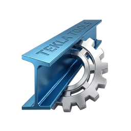

# 🛠️ TEKLA TOOLS - v1.0.1



A comprehensive automation and utility suite for **Tekla Structures**, designed to streamline modeling workflows, find identical assemblies/parts, and audit drawing status with a modern, glassmorphic UI.

---

## 🌍 Language / Dil
- [English](#-features)
- [Türkçe](#-özellikler)

---

## 🚀 Features

- **Assembly Selector**: Find and select all identical assemblies based on geometry (DNA), weight, and position.
- **Part Selector**: Instantly locate identical single parts across the model.
- **Bolt Counter**: Select and count specific bolt groups, providing total quantities.
- **Model Auditor**: Scan the entire model for missing Fabrication or Single Part drawings.
- **Object Inquirer**: View raw object properties and technical data in a clean interface.
- **Bilingual Interface**: Support for both English and Turkish.
- **Auto-Detection**: Automatically detects running Tekla versions (2020-2025).

---

## 🛠️ Installation & Usage

### 1. Requirements
- Tekla Structures (2020 or newer)
- Python 3.10+ (if running from source)
- Dependencies listed in `requirements.txt`

### 2. Running from Source
```bash
pip install -r requirements.txt
python select_assemblies.py
```

### 3. Building EXE
```bash
python build_exe.py
```
The executable will be located in the `dist/` folder.

---

## 🇹🇷 Özellikler

- **Montaj Seçici**: Geometri (DNA), ağırlık ve pozisyon bazlı tıpatıp aynı montajları bulur ve seçer.
- **Parça Seçici**: Model genelindeki tüm özdeş tekil parçaları anında tespit eder.
- **Civata Sayıcı**: Belirli civata gruplarını seçer, sayar ve toplam adet bilgisini sunar.
- **Model Denetçisi**: Modeli tarayarak imalat veya parça çizimi olmayan nesneleri raporlar.
- **Nesne Sorgulayıcı**: Nesne özelliklerini ve teknik verilerini temiz bir arayüzde gösterir.
- **Çift Dil Desteği**: Tamamen Türkçe ve İngilizce arayüz seçeneği.

---

## 📁 Project Structure / Proje Yapısı

- `assets/`: UI icons and logos.
- `docs/`: User manuals and technical documentation.
- `select_assemblies.py`: Main application logic.
- `tekla_env.py`: Tekla API connection manager.
- `requirements.txt`: Python dependency list.

---

## 📜 License
This project is licensed under the **MIT License**. See [LICENSE](LICENSE) for details.

## 👥 Contact
Developed by **KO|Apps**
